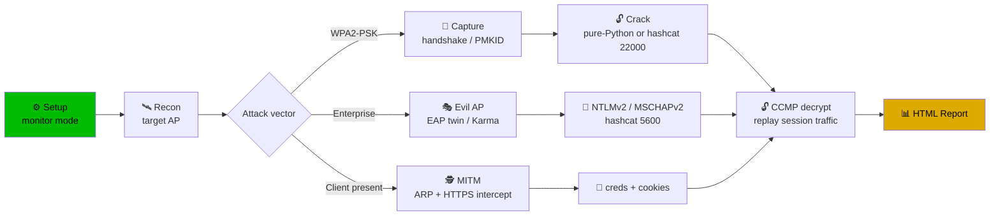
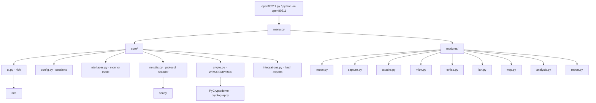

<div align="center">

```
  ___                 ______ ____  ____ _  ___   ____
 / _ \___  ____  __  / __/ // / _ )/ __ ) |/ ( ) / / /__
// / _ \/ __/ __/ |/_/ _\ \/ _  / _  | / _ /    /| / / _ \
/____/\___/__/  _>_</___/_/ /_/ ____/_/ \_/___ |_/_//_/
                          |___/  WIRELESS PENTEST SUITE
```

# ⚡ OPEN80211x

### *The Advanced Wireless & Network Penetration Testing Suite*

*One CLI to recon, crack, intercept, and report — from beacon to post-exploitation.*

[](LICENSE)
[](pyproject.toml)
[](README.md)
[](.github/workflows/ci.yml)
[](https://github.com/xC0D3F4TH3R/OPEN80211x)
[](https://github.com/xC0D3F4TH3R/OPEN80211x)
[](.github/workflows/ci.yml)

> 🛡️ **ETHICAL USE ONLY** — test only networks & systems you own or are authorized to assess.
> Unauthorized use may violate local, national, and international law.

</div>

---

## 📑 Table of Contents

- [🚀 Capability Matrix](#-capability-matrix)
- [🎯 Built For](#-built-for)
- [🖥️ Terminal Preview](#-terminal-preview)
- [🧭 Typical Engagement Workflows](#-typical-engagement-workflows)
- [🏗️ Architecture](#-architecture)
- [⚡ Quick Start](#-quick-start)
- [🧰 Industry Interop — Export Your Hashes](#-industry-interop---export-your-hashes)
- [📁 Output & Artifacts](#-output--artifacts)
- [🧪 Testing & CI](#-testing--ci)
- [🤝 Contributing](#-contributing)
- [⚖️ Legal Disclaimer](#-legal-disclaimer)

---

## 🚀 Capability Matrix

| Suite | Icon | Capabilities | Target |
|------|:----:|--------------|--------|
| **Setup** | ⚙️ | Interface picker · monitor mode · channel control · MAC spoofing · **arsenal detector** | Recon prep |
| **Recon** | 🛰️ | AP discovery (2.4/5 GHz) · **WPA3/SAE/OWE detection** · client probing · wardriving CSV · live signal tracking | Intelligence |
| **Capture** | 🎥 | Live tcpdump-style decode · protocol/port filters · live stats · pcap export · hex dumps | Traffic |
| **Attacks** | 💥 | Deauth flood (targeted/broadcast/continuous) · beacon/assoc/probe flood · WPS (reaver) · **injection tester** · raw frame injector | DoS / weakening |
| **MITM** | 🕵️ | ARP + DNS spoof · SSL-strip · **HTTPS interception** (dynamic CA, per-host certs) · credential/cookie harvest · TLS-SNI fingerprint · **live real-time feed** | Credentials |
| **Evil AP** | 🎭 | Rogue AP (open/WPA2) · **WPA-EAP enterprise evil twin** · **Karma/MANA** · captive portal credential logging | Phishing / hash capture |
| **LAN** | 🖥️ | ARP discovery · port scan + banner grab · **DHCP starvation / rogue DHCP** · **LLMNR/NBT-NS/mDNS poisoning → NTLMv2** · ICMP redirect | Post-exploitation |
| **WEP** | 🕰️ | Fake auth · ARP replay · PRGA capture · **pure-Python RC4 decrypt** · aircrack bridge | Legacy |
| **Analysis** | 🔬 | Handshake + **PMKID** capture · pure-Python **WPA2-PSK cracker** · **AES-CCMP traffic decryption** · pcap inspection · **hash exports** | Offline cracking |
| **Reports** | 📊 | Self-contained **HTML assessment report** · findings · severity · remediation | Documentation |

---

## 🎯 Built For

<table align="center">
<tr>
<td width="33%"><b>🧪 Security Researchers</b><br/><br/>
Deep protocol insight — every decoder exposes the raw bytes, bitfields, and crypto primitives. Inspect RSN/SAE, EAPOL, and TLS handshakes layer-by-layer.</td>
<td width="33%"><b>🛡️ Penetration Testers</b><br/><br/>
The full kill-chain in one tool: recon → capture → attack → intercept → crack → report. Emits hashes in hashcat/aircrack formats your existing arsenal already eats.</td>
<td width="33%"><b>👨‍💻 Developers</b><br/><br/>
Clean, importable architecture (`core/` + `modules/`). Pure-Python crypto with zero external deps for core math. Test suites validate every wire-format change.</td>
</tr>
</table>

---

## 🖥️ Terminal Preview

```
┌──────────────────────────────────────────────────────────────────────┐
│                        ⚡ OPEN80211  v1.0.0                          │
│                  Advanced Wireless Pentest Suite                     │
├──────────────────────────────────────────────────────────────────────┤
│  [!] AUTHORIZED USE ONLY — confirm you own / are permitted.         │
│                                                                      │
│  01 ⚙️ Setup        04 💥 Attacks      07 🖥️ LAN / Network           │
│  02 🛰️ Recon        05 🕵️ MITM         08 🕰️ WEP                    │
│  03 🎥 Capture      06 🎭 Evil AP      09 🔬 Analysis                │
│  10 📁 Results      11 📊 Report       12 ❓ Help                    │
├──────────────────────────────────────────────────────────────────────┤
│  [99] Exit                                                           │
└──────────────────────────────────────────────────────────────────────┘
```

```bash
$ python open80211.py --scan --monitor -c 6

 🛰️  AP SCAN — 2.4GHz/5GHz · channel 6 · 15s
 ┌──────┬─────────────────────────┬──────────┬────────┬──────────┬────────┐
 │ BSSID│ SSID                    │ CH       │ ENC     │ CLIENTS  │ SIGNAL │
 ├──────┼─────────────────────────┼──────────┼────────┼──────────┼────────┤
 │ a4:..│ CorpWifi                │ 6        │ WPA2/PSK│ 12      │ -42dBm │
 │ 74:..│ HomeGuest               │ 1        │ WPA3/SAE│  3      │ -61dBm │
 └──────┴─────────────────────────┴──────────┴────────┴──────────┴────────┘
 [+] WPA3/SAE detected → PMF-protected, note in report
 [+] 4 handshakes + 2 PMKIDs captured · saving results/session-.../
```

---

## 🧭 Typical Engagement Workflows



---

## 🏗️ Architecture



```
open80211/
├── open80211.py                 # entry point + quick commands
├── open80211/
│   ├── menu.py                  # interactive menus
│   ├── core/                    # shared, dependency-free helpers
│   │   ├── config.py            # settings · results storage · privileges
│   │   ├── ui.py                # rich UI, banners, tables, live views
│   │   ├── interfaces.py        # cards · monitor mode · MAC spoof
│   │   ├── netutils.py          # MAC/IP math + full protocol decoder
│   │   ├── crypto.py            # WPA key derivation · CCMP decrypt · PSK crack
│   │   └── integrations.py      # hashcat 22000/5600 · cowpatty · hccapx
│   └── modules/                 # attack suites
│       ├── recon.py   capture.py   attacks.py   mitm.py
│       ├── evilap.py  lan.py       wep.py       analysis.py  report.py
├── test_end_to_end.py           # handshake → crack → decrypt
├── test_advanced.py             # WEP · NTLMv2 · TLS CA · exports · report
└── pyproject.toml               # pip-installable · `open80211` command
```

---

## ⚡ Quick Start

### 🧪 Research / pentest box (recommended: Kali Linux)

```bash
git clone https://github.com/xC0D3F4TH3R/OPEN80211x.git
cd OPEN80211x
pip install -r requirements.txt

# Full arsenal (optional bridges):
sudo apt install hostapd hostapd-mana dnsmasq aircrack-ng reaver tcpdump iw hashcat
```

### 👨‍💻 Developer / pip install

```bash
pip install .            # installs the `open80211` command
open80211 --version
python -m open80211      # or python -m open80211
```

### Run it

```bash
python open80211.py                              # interactive menu
python open80211.py --scan -i wlan0              # one-shot AP scan
python open80211.py --scan --monitor -c 6 -d 15  # auto monitor-mode scan
```

---

## 🧰 Industry Interop — Export Your Hashes

Hand your captures to the rest of your arsenal without re-typing anything:

```bash
# WPA2-PSK → hashcat
hashcat -m 22000 results/.../crack-<ssid>.hc22000 wordlist.txt

# NTLMv2 (from LAN poisoning) → hashcat
hashcat -m 5600  results/.../hashes-ntlmv2.txt wordlist.txt

# WPA2 handshake → aircrack
aircrack-ng -b BSSID -w wordlist capture.pcap

# WEP IVs → aircrack
aircrack-ng capture-wep-ivs.pcap
```

**Built-in export formats:** `hashcat 22000` · `cowpatty` · `hccapx (wpaclean)` · `NTLMv2 5600` · `responder captures (JSON)`.

<details>
<summary><b>🧰 External tool bridges (auto-detected)</b></summary>

<br/>

| Tool | Used for |
|------|----------|
| `aircrack-ng` / `aireplay-ng` | WEP + handshake cracking bridge |
| `reaver` | WPS PIN attacks |
| `hostapd(-mana)` / `dnsmasq` | Rogue AP / Karma + DHCP |
| `hcxdumptool` | PMKID / handshake capture |
| `tcpdump` | capture bridge |
| `bettercap` / `responder` | optional external alternatives |
| `iw` / `airmon-ng` | monitor mode control |

`open80211` runs fully standalone with only the Python deps; every bridge is optional and auto-detected.
</details>

---

## 📁 Output & Artifacts

All results are organized under `results/session-<timestamp>/`:

| Artifact | Description |
|----------|-------------|
| `capture.pcap` | raw traffic (deauth, handshake, data) |
| `crack-<ssid>.hc22000` | hashcat 22000 WPA2 hash |
| `hashes-ntlmv2.txt` | hashcat 5600 NTLMv2 hashes |
| `responder_captures.json` | structured captured creds |
| `mitm-ca/ca.crt` | generated CA (install on target for HTTPS interception) |
| `sessions-<ssid>.json` | cracked PSKs, captured creds, notes |
| `report.html` | full HTML assessment report |

> 🔒 `.gitignore` automatically excludes pcaps, hashes, keys, certs, and all `results/` artifacts from version control.

---

## 🧪 Testing & CI

```bash
python -m compileall -q .     # syntax check
python test_end_to_end.py     # WPA2 handshake → crack → CCMP decrypt
python test_advanced.py       # WEP · NTLMv2 · TLS CA · exports · report
```

GitHub Actions runs **both suites on Python 3.9 → 3.12** on every push/PR — no network or root required.

---

## 🤝 Contributing

Contributions from researchers, pentesters, and devs are very welcome!

- 📖 Read [CONTRIBUTING.md](CONTRIBUTING.md)
- 🐛 Report issues; for security issues use [SECURITY.md](SECURITY.md)
- ⭐ Star the repo — it feeds the algorithm and motivates maintenance
- 🍴 Fork it, add a module, open a PR — new attack vectors & protocol parsers especially welcome

### Roadmap ideas 💡
- 🛰️ Wi-Fi 7 / EHT (802.11be) decoding
- 🔓 WPA3 SAE-online attack support (adapter permitting)
- 🌐 5G/4G CPE and IoT deauth vectors
- 🤖 Telegram/Slack alerting for captured credentials

---

## ⚖️ Legal Disclaimer

> This software is provided for **authorized security testing and research only**. Unauthorized interception, disruption, or access of wireless or wired networks may violate local, national, and international law — including CFAA, the Computer Misuse Act, and telecommunications regulations. **You are solely responsible** for ensuring your activities are permitted and for any consequences of misuse. The author(s) assume no liability whatsoever.

<div align="center">

**Made with 💀 by security researchers — use your powers for good.**

[⬆ Back to top](#-table-of-contents)

</div>